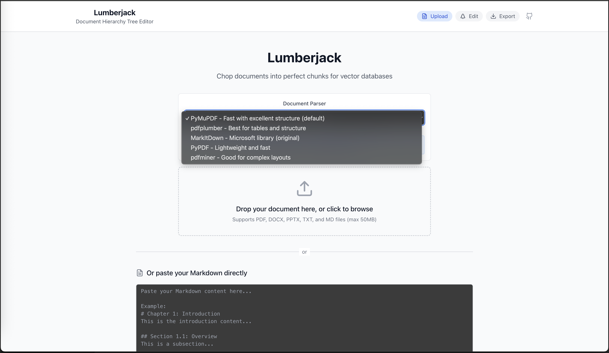

# 🪓 Lumberjack - Document Hierarchy Tree Editor

> Transform your documents into perfectly structured, AI-ready chunks with our intelligent document parser and interactive tree editor.

**🚀 [Try the Live Demo](https://lumberjack-23104.web.app)** - No setup required!


## ✨ Features

- **🔄 Multiple Document Formats**: Support for PDF, DOCX, PPTX, TXT, and MD files with Firebase Storage
- **🤖 5 AI-Powered Parsers**: Choose from MarkItDown, PyMuPDF, pdfplumber, pdfminer.six, and PyPDF
- **☁️ Cloud Processing**: Files uploaded to Firebase Storage and processed in Firebase Functions  
- **🌳 Interactive Tree Editor**: Visualize and edit document hierarchy with expand/collapse
- **📝 Real-time Editing**: Edit content directly with live markdown preview
- **🎯 Smart Chunking**: Configurable token-based chunking with overlap support for vector databases
- **📊 Analytics**: Real-time token counting, word counts, and document statistics
- **🎨 Modern UI**: Beautiful, responsive interface built with React and Tailwind CSS
- **🚀 Production Ready**: Fully deployed on Firebase with Functions and Hosting

## 🎯 Perfect for

- **AI/ML Engineers** preparing documents for vector databases
- **Content Managers** organizing large document collections  
- **Researchers** structuring academic papers and reports
- **Developers** building RAG (Retrieval Augmented Generation) systems

## 📸 Screenshots

### Parser Selection & Document Upload

*Choose from 5 different document parsers, each optimized for different content types*

### Interactive Document Navigation

*Navigate through your document structure with an intuitive tree interface*

### Content Editing & Preview  

*Edit content directly with real-time token counting and markdown preview*

### Smart Export Options

*Export perfectly sized chunks for your vector database or AI system*

## Tech Stack

### Frontend
- **React 18** with TypeScript
- **Vite** for fast development and building
- **Tailwind CSS** for styling
- **react-dnd-treeview** for drag-and-drop tree editing
- **Lucide React** for icons

### Backend
- **Firebase Functions** with Python runtime
- **5 Document Parsers**: MarkItDown, PyMuPDF, pdfplumber, pdfminer.six, PyPDF
- **Firebase Storage** for file uploads
- **Node.js** with Express (for local development)

## 🔥 Firebase Setup & Requirements

### Required Firebase Services

⚠️ **IMPORTANT**: You must enable these Firebase services and upgrade your plan:

#### 1. **Firebase Storage** ⭐ **REQUIRED**
- Navigate to: Firebase Console → Storage → Get started
- **Action Required**: Click "Get started" and follow setup wizard
- **Rules**: Will be deployed automatically via `firebase deploy --only storage`
- **Usage**: Stores uploaded documents (PDF, DOCX, PPTX, TXT, MD files)

#### 2. **Firebase Functions** ⭐ **REQUIRED** 
- Navigate to: Firebase Console → Functions
- **Plan Upgrade Required**: Must upgrade to **Blaze Plan (Pay-as-you-go)**
- **Why**: Python functions require Blaze plan (Firebase free tier only supports Node.js)
- **Cost**: Very low for typical usage (~$1-5/month for moderate use)

#### 3. **Firebase Hosting** ⭐ **REQUIRED**
- Navigate to: Firebase Console → Hosting → Get started  
- **Action Required**: Follow setup wizard
- **Usage**: Hosts the React web application

### Setup Steps

1. **Create Firebase Project**
   - Visit [Firebase Console](https://console.firebase.google.com)
   - Click "Create a project" or "Add project"
   - Follow the 3-step wizard

2. **Upgrade to Blaze Plan**
   - In Firebase Console → Settings → Usage and billing
   - Click "Modify plan" → Select "Blaze"
   - Add payment method (required for Cloud Functions)

3. **Enable Required Services**
   - ✅ **Storage**: Firebase Console → Storage → "Get started"
   - ✅ **Functions**: Will be enabled automatically when you deploy
   - ✅ **Hosting**: Firebase Console → Hosting → "Get started"

### Firebase APIs Used

The application uses these 4 Firebase Function endpoints:

| Endpoint | Method | Purpose | Parameters |
|----------|--------|---------|------------|
| `/health` | GET | Health check for Firebase Functions | None |
| `/parsers` | GET | List available document parsers | None |  
| `/markdown` | POST | Process markdown text directly | `{markdown: string}` |
| `/process` | POST | Process uploaded documents from Firebase Storage | `{fileUrl: string, fileName: string, parser: string}` |

### Cost Estimation

**Typical Monthly Costs (Blaze Plan):**
- **Functions**: $0.50-2.00 (based on usage)
- **Storage**: $0.10-0.50 (1-5GB documents)
- **Hosting**: Free (generous limits)
- **Total**: ~$1-5/month for moderate usage

**Free Tier Limits (included in Blaze):**
- 2 million function invocations/month
- 5GB Storage
- 10GB Hosting transfer

## Prerequisites

Before running this application, make sure you have:

1. **Node.js** (version 16 or higher)
2. **Firebase Project** with Blaze Plan (see Firebase Setup above)
3. **Firebase CLI**: `npm install -g firebase-tools`
4. **Git** for cloning the repository

**For Local Development Only:**
- **Python 3** (for local document parsing)
- **pip** (Python package manager)

## Installation

1. **Clone the repository**
   ```bash
   git clone <repository-url>
   cd AutoChunker
   ```

## 🚀 Quick Start

### Option 1: Try the Live Demo (Recommended)
**[🌐 https://lumberjack-23104.web.app](https://lumberjack-23104.web.app)**

1. Click the demo link above
2. Upload your document or paste markdown content  
3. Choose your preferred parser (PyMuPDF recommended)
4. Edit and export your structured content
5. No setup required - works instantly!

### Option 2: Run Locally

2. **Configure Firebase credentials**
   ```bash
   cd client
   cp env.example .env
   # Edit .env with your Firebase credentials
   ```

3. **Run the setup script** (handles everything automatically)
   ```bash
   ./setup.sh
   ```

   Or install manually:
   ```bash
   # Create Python virtual environment
   python3 -m venv venv
   source venv/bin/activate
   pip install markitdown
   
   # Install Node.js dependencies
   npm install
   cd server && npm install
   cd ../client && npm install
   ```

## Running the Application

### Easy Start (Recommended)

```bash
./start-local.sh
```

This will start both servers and open the application at `http://localhost:3000`

### Manual Start

Start backend:
```bash
cd server
node index.js
```

Start frontend (in a new terminal):
```bash
cd client
npm run dev
```

This will start:
- Backend server on `http://localhost:3001`
- Frontend development server on `http://localhost:3000`

### Production Build

1. Build the frontend:
   ```bash
   npm run build
   ```

2. Start the production server:
   ```bash
   npm start
   ```

## Usage

1. **Upload Document**
   - Visit `http://localhost:3000`
   - Upload a document (PDF, DOCX, PPTX, TXT, or MD) or paste Markdown directly
   - The document will be automatically converted to Markdown

2. **Edit Hierarchy**
   - View the generated document hierarchy tree
   - Drag and drop sections to reorganize structure
   - Edit section titles by clicking the edit icon
   - Delete sections with the trash icon
   - Select sections to preview their content

3. **Export Chunks**
   - Configure chunking options (max tokens, overlap, etc.)
   - Preview the generated chunks
   - Export as JSON or Markdown format

## API Endpoints

### Backend API

- `GET /api/health` - Health check endpoint
- `POST /api/upload` - Upload document and convert to Markdown
- `POST /api/markdown` - Process raw Markdown text

## Configuration

### Chunking Options

- **Max Tokens per Chunk**: Maximum number of tokens per chunk (default: 1000)
- **Overlap Tokens**: Number of overlapping tokens between chunks (default: 100)
- **Preserve Headers**: Include section headers in chunks (default: true)
- **Include Metadata**: Include metadata in export (default: true)

### File Upload Limits

- Maximum file size: 50MB
- Supported formats: PDF, DOCX, PPTX, TXT, MD

## Project Structure

```
AutoChunker/
├── client/                 # React frontend
│   ├── src/
│   │   ├── components/     # React components
│   │   ├── types.ts       # TypeScript types
│   │   ├── utils/         # Utility functions
│   │   └── App.tsx        # Main app component
│   ├── package.json
│   └── vite.config.ts
├── server/                 # Node.js backend
│   ├── index.js           # Express server
│   └── package.json
├── package.json           # Root package.json
└── README.md
```

## Development

### Frontend Development

The frontend is built with React and Vite. Key components:

- `FileUpload`: Handles file upload and drag-and-drop
- `MarkdownInput`: Direct Markdown input interface
- `TreeEditor`: Interactive tree editing with drag-and-drop
- `MarkdownPreview`: Live preview of document content
- `ChunkExporter`: Chunk configuration and export

### Backend Development

The backend is a simple Express server that:

- Handles file uploads with Multer
- Converts documents using MarkItDown
- Serves the React app in production

### Adding New Features

1. **New Document Formats**: Add support in the backend by updating the file filter and MarkItDown integration
2. **Custom Chunking Strategies**: Extend the chunking logic in `utils/markdownParser.ts`
3. **Export Formats**: Add new export options in `ChunkExporter.tsx`

## Troubleshooting

### Common Issues

1. **MarkItDown not found**
   - Ensure Python 3 is installed
   - Install MarkItDown: `pip install markitdown`

2. **File upload fails**
   - Check file size (max 50MB)
   - Ensure file format is supported

3. **Tree editor not working**
   - Check browser console for JavaScript errors
   - Ensure all dependencies are installed

### Error Messages

- `"MarkItDown error"`: Python or MarkItDown installation issue
- `"File too large"`: File exceeds 50MB limit
- `"Invalid file type"`: Unsupported file format

## Contributing

1. Fork the repository
2. Create a feature branch
3. Make your changes
4. Test thoroughly
5. Submit a pull request

## 📊 Parser Comparison

| Parser | Speed | Structure | Tables | Images | Best For |
|--------|-------|-----------|--------|---------|----------|
| **PyMuPDF** | ⭐⭐⭐⭐⭐ | ⭐⭐⭐⭐ | ⭐⭐⭐ | ⭐⭐⭐⭐ | General purpose, fast processing |
| **pdfplumber** | ⭐⭐⭐ | ⭐⭐⭐⭐⭐ | ⭐⭐⭐⭐⭐ | ⭐⭐ | Complex layouts, tables |
| **MarkItDown** | ⭐⭐⭐⭐ | ⭐⭐⭐⭐ | ⭐⭐⭐⭐ | ⭐⭐⭐ | Microsoft documents |
| **PyPDF** | ⭐⭐⭐⭐ | ⭐⭐⭐ | ⭐⭐ | ⭐⭐ | Lightweight, simple PDFs |
| **pdfminer** | ⭐⭐ | ⭐⭐⭐⭐⭐ | ⭐⭐⭐ | ⭐⭐ | Complex layouts, research papers |

## 🚀 Deployment

```bash
# Deploy everything (hosting + functions + storage rules)
./deploy.sh

# Or deploy individually  
firebase deploy --only hosting
firebase deploy --only functions
firebase deploy --only storage
```

## 🤝 Contributing

We welcome contributions! Here's how to get started:

1. Fork the repository
2. Create a feature branch: `git checkout -b feature/amazing-feature`
3. Commit your changes: `git commit -m 'Add amazing feature'`
4. Push to the branch: `git push origin feature/amazing-feature`
5. Open a Pull Request

## 📝 License

This project is licensed under the MIT License - see the [LICENSE](LICENSE) file for details.

## 🙋‍♂️ Support & Links

- **🌐 Live Demo**: [https://lumberjack-23104.web.app](https://lumberjack-23104.web.app)
- **📖 Documentation**: Check our [Wiki](https://github.com/pandaxbacon/AutoChunker/wiki)  
- **🐛 Issues**: Report bugs via [GitHub Issues](https://github.com/pandaxbacon/AutoChunker/issues)
- **💬 Discussions**: Join our [GitHub Discussions](https://github.com/pandaxbacon/AutoChunker/discussions)

## 🙏 Acknowledgments

- Microsoft MarkItDown for document conversion
- React DnD Treeview for the tree editing interface
- Tailwind CSS for styling
- Lucide React for icons

---

<div align="center">

**Built with ❤️ for the AI community**

[🚀 Try Live Demo](https://lumberjack-23104.web.app) • [📖 Documentation](https://github.com/pandaxbacon/AutoChunker/wiki) • [🐛 Report Bug](https://github.com/pandaxbacon/AutoChunker/issues) • [💡 Request Feature](https://github.com/pandaxbacon/AutoChunker/issues)

</div>
